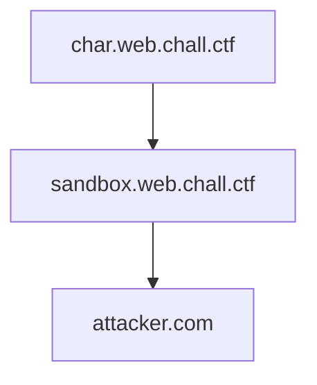

# W4 Schools

## Author 

bubu

## Category

web

## Difficulty

hard 

## Description

I’m creating a new website to learn HTML. Sandboxing shouldn’t be too difficult, right?

## Attachment

Attachments: `w4schools.tar.gz`

## Deployment Notes

Challenge has four containers: `reverse-proxy`, `web`, `sandbox` and `bot`. `web` and `sandbox` should run in different subdomains. 
All the subdomains of `web` (`*.web.chall.ctf`) should go to `web` container. 
`web` includes in the DOM the visited domain and a sandboxed `iframe` with `src=http://sandbox.chall.ctf/?code=WEB_SANDBOX_GET_PARAM`.
`sandbox` which has [sandbox protections](https://developer.mozilla.org/en-US/docs/Web/HTML/Reference/Elements/iframe#sandbox) and allows to include any HTML code. `sandbox.chall.ctf` (change `chall.env`) should go to `sandbox`. Both of the containers run in port 80 and the `nginx` reverse proxy is for being able to do the setup for local testing. Maybe this can be changed in remote because kctf has it's own reverse-proxy.

In the case of `bot`, publishes the port `1337` for reporting code that will be visited by the bot. I had to add `network_mode: host` to be able to run this on local (otherwise the `bot` can't visit `sandbox.localhost`), we can change this in remote. 

TL;DR. Change `chall.env` with the real origins and be sure `WHATEVER.web.chall.ctf` goes to `web` container. Remove `network_mode: host` in `docker-compose.yaml`.

## Bot Logic

Bot will visit each character of the flag using `CHAR.web.chall.ctf?sandbox=PLAYER_CODE`. 

## Solution

The solution is to leak one-by-one character of the flag using `frame-ancestors` of `Content-Security-Policy` (CSP). 
One thing people might be not aware of, is that `frame-ancestors` not only applies to the url in which is included but also in all the tree.

