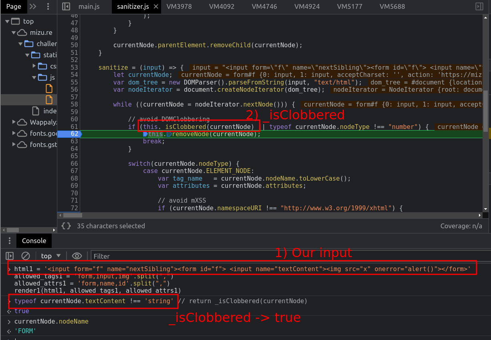
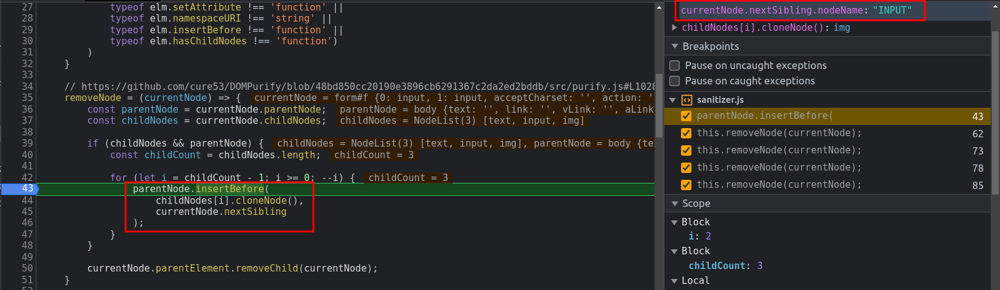

## Chall -- [Kevin Mizu](https://twitter.com/kevin_mizu)
#### `DOM Clobbering` and `XSS`

In this challenge, the author developed a webpage to sanitize XSS payloads. For this goal, the webpage sanitizes attacker inputs by utilizing code snippets from the DOM Purify project in conjunction with the tags specified within the Chromium code.

In my case, what I attempted was to search for any discrepancies between the code utilized and the most recent commits in both projects. Unfortunately, I was unable to find a solution for the challenge at that time. So, I'm writing this writeup after checking the [author solution](https://twitter.com/kevin_mizu/status/1701922141791211776) and learning how the exploit works.

#### Code Analysis

As the author explains in his twitter in the following code snippets is the key for the chall.

```javascript
    // Code of `sanitizer.js`
    sanitize = (input) => {
        // Step 1: Convert the Attacker string to a DOM Tree using DOM Parser API.
        let currentNode;
        var dom_tree = new DOMParser().parseFromString(input, "text/html");

        // Step 2: Create an iterator for the nodes.
        var nodeIterator = document.createNodeIterator(dom_tree);

        while ((currentNode = nodeIterator.nextNode())) {

            // Step 3: Sanitize the node
            // avoid DOMClobbering
            if (this._isClobbered(currentNode) || typeof currentNode.nodeType !== "number") {
                this.removeNode(currentNode);
                continue;
            }

            switch(currentNode.nodeType) {
                case currentNode.ELEMENT_NODE:
                    var tag_name   = currentNode.nodeName.toLowerCase();
                    var attributes = currentNode.attributes;

                    // avoid mXSS
                    if (currentNode.namespaceURI !== "http://www.w3.org/1999/xhtml") {
                        this.removeNode(currentNode);
                        continue;

                    // sanitize tags
                    } else if (!this.ALLOWED_TAGS.includes(tag_name)){
                        this.removeNode(currentNode);
                        continue;
                    }

                    // sanitize attributes
                    for (let i=0; i < attributes.length; i++) {
                        if (!this.ALLOWED_ATTS.includes(attributes[i].name)){
                            this.removeNode(currentNode);
                            continue;
                        }
                    }
            }
        }

        // Step 4: return the `safe` string
        return dom_tree.body.innerHTML;
    }
```

If the node that we are checking (e.g. ``) has any illegal behavior (tag, attribute..) it basically calls the function to remove that node. 

```javascript
    removeNode = (currentNode) => {
        const parentNode = currentNode.parentNode;
        const childNodes = currentNode.childNodes;

        if (childNodes && parentNode) {
            const childCount = childNodes.length;

            for (let i = childCount - 1; i >= 0; --i) {
                parentNode.insertBefore(
                    childNodes[i].cloneNode(),
                    currentNode.nextSibling    // Here is the DOM Clobbering
                );
            }
        }

        currentNode.parentElement.removeChild(currentNode);
    }
```

#### Chall Solution 

The solution for the challenge consist in clobbering the `nextSibling` attribute in the `removeNode` function. In other words, the idea is to clobber the `nextSibling` with a previous element in order to avoid the sanitization of our payload. We avoid the sanitization because instead of adding the node (a.k.a payload) before the following node (a.k.a `nextSibling`) that is going to be checked, we are moving it before a node that was checked. So, in the next iterator node, the childNodes would be gone. In the following code, the author presents the solution.

```html
<input form="f" name="nextSibling">
<form id="f"> 
    <input name="textContent">
    
</form>
```

In this code snippet, as you see, we are clobbering the `nextSibling` with the first input and the form. After that, we need to add the payload inside the form, so that, in the moment of removing the node (`form`), the function will add the child nodes (`input2` and `img`) to `nextSibling` (because of the clobber, `input1`). Doing that, our payload `img` would avoid the sanitization. The second `input` is used to provoke the error in the `form`.




I present a similar solution, that could be more clear because we avoid the second `input` provoking the error in the `form` using the attribute `onload`.

```html
<input form="f" name="nextSibling">
<form id="f" onload> 
    
</form>
```

Recap: Thanks to the DOM Clobbering of `nextSibling`, we avoid that our payload, inside a `form`, gets sanitizated. 


#### Fix the vuln 

If we check the `DOMPurify` project we can see that they have some checks to see if `nextSibling` is clobbered ([github](https://github.com/cure53/DOMPurify/blob/main/src/purify.js#L117)).

```javascript
const getNextSibling = lookupGetter(ElementPrototype, 'nextSibling');
// ...

    parentNode.insertBefore(
      cloneNode(childNodes[i], true),
      getNextSibling(currentNode)
    );
```

I encourage the reader to explore how the clobbering protection works. I made the fix for avoiding the clobbering in the `src_fixed` folder.

#### Useful refs:
- [DOMParser API](https://developer.mozilla.org/en-US/docs/Web/API/DOMParser). 
- [DOMPurify repo](https://github.com/cure53/DOMPurify/blob/main/src/purify.js) by Cure53.
